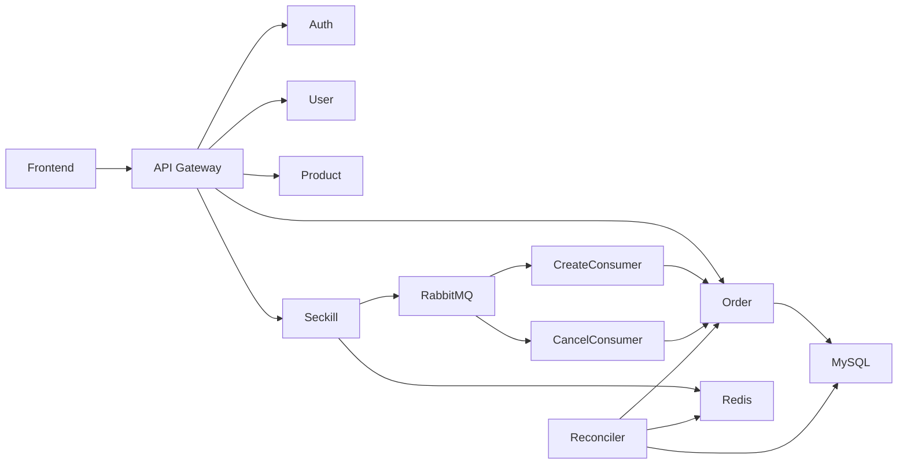
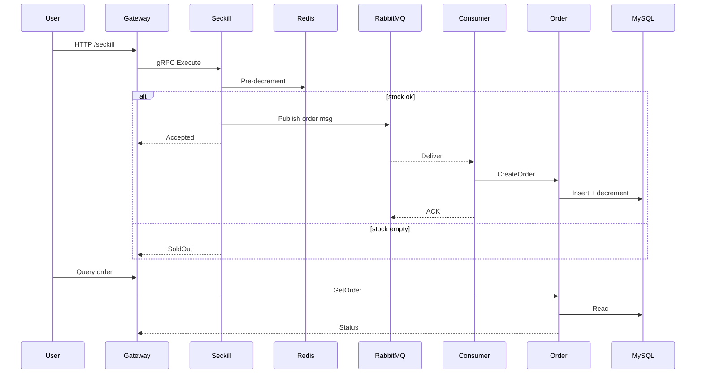

# Go 高并发秒杀系统 (Seckill System)

🚀 一个在资源受限环境下依然实现稳定高并发、低延迟与数据一致性的秒杀后端。架构：**API Gateway + gRPC 微服务 + Redis 预减库存 + RabbitMQ 异步削峰 + MySQL 持久化 + 定时库存对账**。

    

## 📌 为什么做这个项目 (Problem → Solution → Result)

在真实高并发场景下，秒杀会集中暴露“数据库写放大、库存一致性、重复/恶意请求、消息可靠”四类典型痛点；本项目的目标是在资源有限条件下仍保持稳定、可恢复与最终一致。

| Problem | Solution | Result |
|---------|----------|--------|
| 热门商品瞬时流量冲击数据库导致超卖与大量行锁竞争 | Redis 原子 Lua 预减库存 + 单键/单槽简化热点 + 仅在扣减成功后入队 | 请求阶段几乎全在内存与网络，显著削峰，避免 DB 写爆 |
| 库存扣减成功但订单写入/消息投递异常造成不一致 | RabbitMQ 发布确认 + 消费端幂等校验(msgId) + 对账补偿(Reconciler) | 消息与订单最终一致，无超卖/重复订单 |
| 重复/恶意请求刷接口影响库存准确与队列膨胀 | JWT 鉴权 + 令牌桶限流 + 用户+商品幂等键/Redis 标记 | 入口受控，降低无效写与热点争用 |
| 批量订单写入造成写放大与慢 SQL 阻塞 | MQ 异步削峰 + 批量消费聚合写入 + 连接池/事务粒度优化 | 均衡数据库压力，降低单事务耗时与锁竞争 |

> 设计原则：先削峰再落库，先缓存校验再持久化，失败可补偿，过程可观测。若需更详细演进过程见 `ARCHITECTURE.md`。

## 🏗 架构总览

### 架构图 (Simplified)



### 秒杀时序图 (Simplified)



## ✨ 核心亮点 (Key Features)

- 🔧 微服务拆分：`auth / user / product / seckill / order / stock_reconciler / api_gateway` 独立部署与水平扩展。
- ⚡ 高性能通信：内部使用 `gRPC + Protobuf`，网关对外统一 HTTP/JSON。
- 🧠 秒杀链路：Redis 预减库存 → 推送异步订单消息 → 批量消费落库 → 对账服务定期校准。
- 🔒 安全与治理：JWT 鉴权、速率限制、幂等校验、防止重复下单与恶意刷接口。
- 📦 一致性保障：消息发布确认、`MessageId` 幂等消费、库存对账补偿机制。
- 🧪 压测验证：在低配置服务器与本地开发环境均达到稳定高吞吐与 100% 成功率。

## 🧪 性能基准 (Benchmarks)

| 场景 | 并发参数 | 总请求 | 总耗时 | 平均延迟 | Requests/sec | P99 | 环境 |
|------|----------|--------|--------|----------|----------------------|-----|------|
| 单商品秒杀 | `-c 150 -n 50000 --connections=120` | 50,000 | 11.15s | 27.82ms | 4,484 | 85.83ms | 4C4G 云服务器 |
| 单商品秒杀 | `-c 500 -n 500000 --connections=200` | 500,000 | 28.99s | 28.64ms | 17,248 | 97.09ms | r5-7640HS 轻薄本 |

**特点：** 全量成功 (0 错误)、平均延迟 <30ms、P99 <100ms。资源有限仍保持稳定吞吐。

### 压测命令示例 (ghz)

```bash
ghz --insecure \
  --proto proto/seckill.proto \
  --call seckill.SeckillService.ExecuteSeckill \
  --data-file output.json \
  -c 150 -n 50000 --connections=120 --timeout=2s localhost:50053

ghz --insecure \
  --proto proto/seckill.proto \
  --call seckill.SeckillService.ExecuteSeckill \
  --data-file output.json \
  -c 500 -n 500000 --connections=200 --timeout=2s localhost:50053
```

## 🧰 技术栈 (Tech Stack)

| Layer | Technology | Notes |
|-------|------------|-------|
| Language | Go 1.25 | 高并发 + 原生多协程 |
| Gateway | Gin | HTTP 入口 / 中间件治理 |
| RPC | gRPC + Protobuf | 内部高性能通信 |
| Cache | Redis (单实例或可扩展 Cluster) | 库存预减 / 热数据 / Lua 脚本 |
| Queue | RabbitMQ | 削峰 + 异步解耦 + 幂等消息 |
| DB | MySQL + GORM | 事务与持久化 |
| Config | Viper | 统一配置加载 |
| Logging | Zap + Lumberjack | 结构化日志 + 滚动切割 |
| Security | JWT / RateLimit | 接口防滥用 |
| Tooling | ghz | 压测与容量评估 |

## 📂 目录结构

```text
backend/
├── api/                 # HTTP 入口 & 中间件 (JWT / 限流 / 渲染)
├── cmd/                 # 各微服务 / 消费者 / 对账入口 main.go
├── config/              # 本地 & 容器化配置文件
├── internal/            # 业务实现 (dao/service/mq/client/...)
├── pkg/                 # 公共工具 (logger / error / bootstrap / utils)
├── proto/               # .proto 定义 (auth/product/seckill/order/user)
├── proto_output/        # 生成的 gRPC 代码
└── docker-compose.yml   # 编排文件
```

## ⚙️ 快速开始 (Quick Start)

### 1. 克隆仓库

```bash
git clone https://github.com/CCDD2022/seckill-system.git
cd seckill-system/backend
```

### 2. Docker 启动

```bash
docker compose up -d --build
```

### 3. 查看运行状态

```bash
docker compose ps
```

### 4. 本地开发 (按需单独启动)

```bash
go run cmd/api_gateway/main.go
go run cmd/seckill_service/main.go
go run cmd/order_create_consumer/main.go
```
确保 MySQL / Redis / RabbitMQ 已启动并配置正确。

### 5. 配置说明

| 文件 | 用途 |
|------|------|
| `config.yaml` | 本地开发默认配置 |
| `config.docker.yaml` | 容器环境使用，通过 `CONFIG_PATH` 指定 |

RabbitMQ 默认 `guest/guest` 受限：生产建议创建专用用户：

```bash
rabbitmqctl add_user seckill_prod strong_password_here
rabbitmqctl set_user_tags seckill_prod administrator
rabbitmqctl set_permissions -p / seckill_prod ".*" ".*" ".*"
```

### 6. Nginx 反向代理示例

```nginx
location /api/ {
  proxy_pass http://127.0.0.1:8080;
  proxy_set_header X-Forwarded-For $proxy_add_x_forwarded_for;
  proxy_set_header X-Real-IP $remote_addr;
}
```

## 🔐 核心中间件 & 策略

- 鉴权：`JWT` 访问令牌，过期刷新策略（可扩展）。
- 限流：令牌桶 / 配置化速率，保护热点接口。
- 幂等：订单请求携带用户+商品维度幂等键；消息层使用 `MessageId`。
- 防超卖：库存 Redis 单键 + Lua 原子减库存 + 阈值校验。
- 一致性：批量插入 + 对账服务比对 Redis 预减与 DB 实际销量。

## 🔄 秒杀流程 (Seckill Flow)

1. 用户请求进入网关，鉴权 + 限流。
2. Seckill Service 使用 Redis 预减库存 (原子 Lua)。
3. 预减成功 → 发送订单创建消息到 RabbitMQ。
4. 消费者批量提取消息，构建订单批量写入 MySQL。
5. 定时对账扫描 Redis 脏数据集 / 或对比订单完成情况回补异常。
6. 用户通过查询接口获取订单状态。

## 🛠 调优参数 (Tuning Knobs)

| 参数 | 作用 | 调优建议 |
|------|------|---------|
| `mq.consumer_prefetch` | 消费端预取批量 | 增大提升吞吐，过大可能加长尾延迟 |
| `mq.order_batch_size` | 单批写入订单数量 | CPU/IO vs 延迟折中 |
| `order_batch_interval_ms` | 批次形成最大等待时间 | 防止低流量下批次迟迟不落库 |
| `rate_limits.seckill` | 秒杀入口 QPS 控制 | 压测阶段可临时放开 |
| `channel_pool_size` | MQ Channel 复用池大小 | 根据并发与连接开销设定 |

## 🧪 API 示例

```bash
# 注册
curl -X POST http://localhost:8080/api/v1/auth/register \
  -H 'Content-Type: application/json' \
  -d '{"username":"testuser","password":"password123","email":"test@example.com","phone":"13800138000"}'

# 登录
curl -X POST http://localhost:8080/api/v1/auth/login \
  -H 'Content-Type: application/json' \
  -d '{"username":"testuser1","password":"password123"}'

# 获取商品
curl -H "Authorization: Bearer <JWT>" \
  http://localhost:8080/api/v1/products?page=1&page_size=10

# 执行秒杀
curl -X POST http://localhost:8080/api/v1/seckill/execute \
  -H "Authorization: Bearer <JWT>" -H "Content-Type: application/json" \
  -d '{"product_id":1,"quantity":1}'
```

### 测试账号

`testuser1 / testuser2 / testuser3` 密码统一：`password123`

## 🧭 Roadmap

- [ ] 支持多商品并行秒杀隔离策略 (分槽 / 分片)
- [ ] 增加分布式追踪 (OpenTelemetry)
- [ ] 增加指标上报 (Prometheus + Grafana Dashboard)
- [ ] 加入熔断 / 降级策略 (Hystrix-like)
- [ ] 自动重试与死信队列处理优化
- [ ] 灰度发布 / Canary 流量拆分


## 📄 License

本项目采用 [MIT License](LICENSE)。
