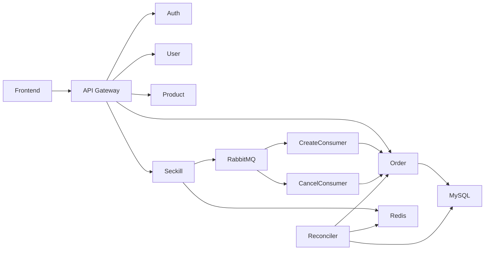
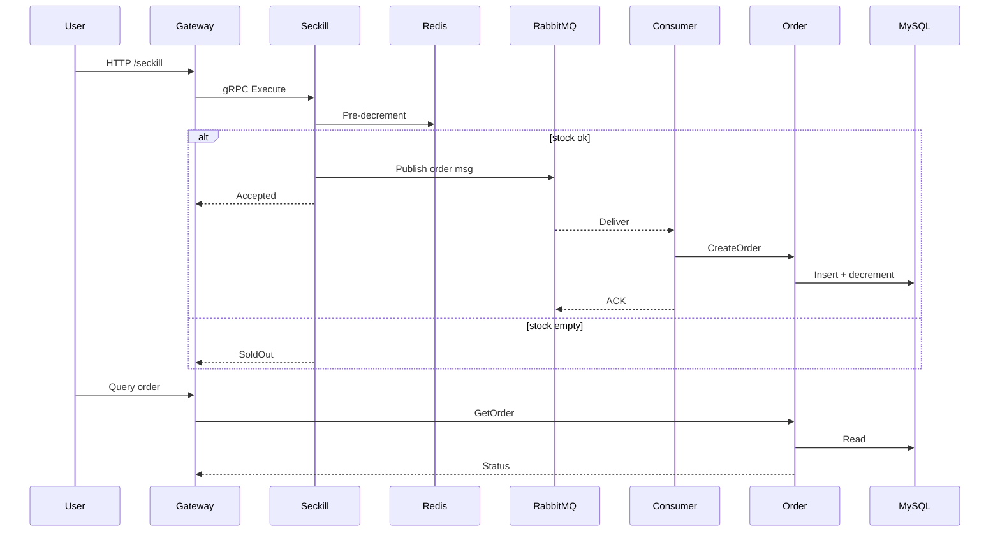

# Go 高并发秒杀系统 (Seckill System)

🚀 一个在资源受限环境下依然实现稳定高并发、低延迟与数据一致性的秒杀后端。架构：**API Gateway + gRPC 微服务 + Redis 预减库存 + RabbitMQ 异步削峰 + MySQL 持久化 + 定时库存对账**。

    

## 📌 为什么做这个项目 (Problem → Solution → Result)

## 🏗 架构总览


### 架构图 (Simplified)



### 秒杀时序图 (Simplified)



## 📂 目录结构

```text
backend/
├── api/                 # HTTP 入口 & 中间件 (JWT / 限流 / 渲染)
├── cmd/                 # 各微服务 / 消费者 / 对账入口 main.go
├── config/              # 本地 & 容器化配置文件
├── internal/            # 业务实现 (dao/service/mq/client/...)
├── pkg/                 # 公共工具 (logger / error / bootstrap / utils)
├── proto/               # .proto 定义 (auth/product/seckill/order/user)
├── proto_output/        # 生成的 gRPC 代码
└── docker-compose.yml   # 编排文件
```

## ⚙️ 快速开始 (Quick Start)

### 1. 克隆仓库

```bash
git clone https://github.com/CCDD2022/seckill-system.git
cd seckill-system/backend
```

### 2. Docker 启动

```bash
docker compose up -d --build
```

### 3. 查看运行状态

```bash
docker compose ps
```

### 4. 本地开发 (按需单独启动)

```bash
go run cmd/api_gateway/main.go
go run cmd/seckill_service/main.go
go run cmd/order_create_consumer/main.go
```
确保 MySQL / Redis / RabbitMQ 已启动并配置正确。

### 5. 配置说明

| 文件 | 用途 |
|------|------|
| `config.yaml` | 本地开发默认配置 |
| `config.docker.yaml` | 容器环境使用，通过 `CONFIG_PATH` 指定 |

RabbitMQ 默认 `guest/guest` 受限：生产建议创建专用用户：

```bash
rabbitmqctl add_user seckill_prod strong_password_here
rabbitmqctl set_user_tags seckill_prod administrator
rabbitmqctl set_permissions -p / seckill_prod ".*" ".*" ".*"
```

### 6. Nginx 反向代理示例

```nginx
location /api/ {
  proxy_pass http://127.0.0.1:8080;
  proxy_set_header X-Forwarded-For $proxy_add_x_forwarded_for;
  proxy_set_header X-Real-IP $remote_addr;
}
```

## 🔐 核心中间件 & 策略

- 鉴权：`JWT` 访问令牌，过期刷新策略（可扩展）。
- 限流：令牌桶 / 配置化速率，保护热点接口。
- 幂等：订单请求携带用户+商品维度幂等键；消息层使用 `MessageId`。
- 防超卖：库存 Redis 单键 + Lua 原子减库存 + 阈值校验。
- 一致性：批量插入 + 对账服务比对 Redis 预减与 DB 实际销量。

## 🔄 秒杀流程 (Seckill Flow)

1. 用户请求进入网关，鉴权 + 限流。
2. Seckill Service 使用 Redis 预减库存 (原子 Lua)。
3. 预减成功 → 发送订单创建消息到 RabbitMQ。
4. 消费者批量提取消息，构建订单批量写入 MySQL。
5. 定时对账扫描 Redis 脏数据集 / 或对比订单完成情况回补异常。
6. 用户通过查询接口获取订单状态。

## 🛠 调优参数 (Tuning Knobs)

| 参数 | 作用 | 调优建议 |
|------|------|---------|
| `mq.consumer_prefetch` | 消费端预取批量 | 增大提升吞吐，过大可能加长尾延迟 |
| `mq.order_batch_size` | 单批写入订单数量 | CPU/IO vs 延迟折中 |
| `order_batch_interval_ms` | 批次形成最大等待时间 | 防止低流量下批次迟迟不落库 |
| `rate_limits.seckill` | 秒杀入口 QPS 控制 | 压测阶段可临时放开 |
| `channel_pool_size` | MQ Channel 复用池大小 | 根据并发与连接开销设定 |

## 🧪 API 示例

```bash
# 注册
curl -X POST http://localhost:8080/api/v1/auth/register \
  -H 'Content-Type: application/json' \
  -d '{"username":"testuser","password":"password123","email":"test@example.com","phone":"13800138000"}'

# 登录
curl -X POST http://localhost:8080/api/v1/auth/login \
  -H 'Content-Type: application/json' \
  -d '{"username":"testuser1","password":"password123"}'

# 获取商品
curl -H "Authorization: Bearer <JWT>" \
  http://localhost:8080/api/v1/products?page=1&page_size=10

# 执行秒杀
curl -X POST http://localhost:8080/api/v1/seckill/execute \
  -H "Authorization: Bearer <JWT>" -H "Content-Type: application/json" \
  -d '{"product_id":1,"quantity":1}'
```

### 测试账号

`testuser1 / testuser2 / testuser3` 密码统一：`password123`

## 🧭 Roadmap

- [ ] 支持多商品并行秒杀隔离策略 (分槽 / 分片)
- [ ] 增加分布式追踪 (OpenTelemetry)
- [ ] 增加指标上报 (Prometheus + Grafana Dashboard)
- [ ] 加入熔断 / 降级策略 (Hystrix-like)
- [ ] 自动重试与死信队列处理优化
- [ ] 灰度发布 / Canary 流量拆分


## 📄 License

本项目采用 [MIT License](LICENSE)。
