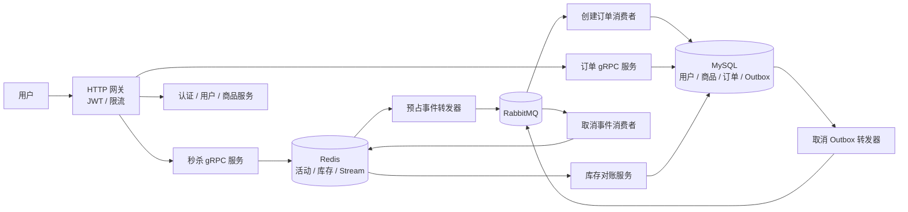

# Go 秒杀系统

一个用于研究**突发请求、库存不超卖、异步订单与故障恢复**的 Go 后端项目。对外提供 Gin HTTP API；内部使用 gRPC，Redis 负责库存预占，RabbitMQ 传递订单事件，MySQL 保存订单和商品记录。

项目的核心约定是：**秒杀接口快速返回“预占已受理”，订单随后异步落库。** 因此接口响应速度与最终订单吞吐是两项不同指标。当前实现面向单机 Docker Compose 演示和实验，不宣称已经具备多节点生产部署能力。详细设计和故障边界见 [ARCHITECTURE.md](ARCHITECTURE.md)。

## 要解决的问题

| 问题 | 当前做法 |
| --- | --- |
| 并发争抢导致超卖或同一用户重复下单 | Redis Lua 同时检查活动时间、参与标记与库存；MySQL 对消息 ID 和“用户＋商品”设唯一约束 |
| Redis 扣库存成功，但订单消息还没发出时进程崩溃 | 在同一次 Redis 脚本执行中扣库存并写入 Stream；独立转发器确认 RabbitMQ 收到后才确认 Stream 事件 |
| 订单取消成功，但回补库存的消息丢失 | 在同一个 MySQL 事务中更新订单状态并写取消 outbox；转发器持续重试，消费者按事件 ID 只回补一次 |
| MySQL 商品库存跟不上抢购流量 | 抢购时以 Redis 库存为准；对账服务异步把变化同步到 MySQL 商品库存快照 |

这里采用**至少投递一次消息＋幂等业务效果**。RabbitMQ 重投可能发生；消费者必须能安全地再次处理同一事件。

## 架构与数据归属


```mermaid
flowchart LR
  U[用户] --> G[HTTP 网关<br/>JWT / 限流]
  G --> S[秒杀 gRPC 服务]
  G --> O[订单 gRPC 服务]
  G --> A[认证 / 用户 / 商品服务]
  S --> R[(Redis<br/>活动 / 库存 / Stream)]
  R --> SR[预占事件转发器]
  SR --> Q[(RabbitMQ)]
  Q --> C[创建订单消费者]
  C --> DB[(MySQL<br/>用户 / 商品 / 订单 / Outbox)]
  O --> DB
  DB --> OR[取消 Outbox 转发器]
  OR --> Q
  Q --> CC[取消事件消费者]
  CC --> R
  R --> REC[库存对账服务]
  REC --> DB
```

- **Redis 是活动期间可售库存的判断依据。** 活动价格、起止时间在商品创建后不可修改，缓存到 Redis。Lua 使用 Redis 服务器时间再次检查活动窗口，然后完成去重、扣库存、记录待发事件。库存键缺失时拒绝秒杀，不用可能滞后的 MySQL 库存自动重建。
- **Redis Stream 是预占后的可靠交接点。** `reservation-relay` 把事件发布到 RabbitMQ；只有收到发布确认且消息可路由，才确认 Stream 中的事件。确认结果不明时会重发，MySQL 唯一约束负责挡住重复落单。
- **RabbitMQ 负责异步传递与积压缓冲。** 创建订单消费者落库后才 ACK；MySQL 暂时不可用时退避重试。格式错误或与已落库订单冲突的消息进入死信队列，再持久归档以供核查。
- **MySQL 保存订单最终状态。** 取消待支付订单时，状态变更与取消事件写入同一事务。取消消费者核对订单后，在 Redis 原子地回补库存并记录已处理事件。
- **MySQL 商品库存是异步快照。** 对账服务写库成功后，仅当 Redis 库存仍等于本次读取值才移除待对账标记；进程中断或写库失败会留下任务供下次处理。

入口 JWT、管理员角色和按 IP 令牌桶位于 HTTP 网关；内部 gRPC 不向宿主机开放。直接暴露这些 gRPC 端口会绕开网关控制。相关实现见 [预占脚本](internal/dao/seckill_reservation.go)、[创建订单消费者](cmd/order_create_consumer/main.go)、[取消事务](internal/dao/order_dao.go)和[库存对账](cmd/stock_reconciler/main.go)。

## HTTP 错误与异步请求

| HTTP 结果 | 含义 | 下一步 |
| --- | --- | --- |
| `202 Accepted` | Redis 已预占库存并记录待发事件；响应含 `request_id`、`state: processing` 和 `status_url`，无订单 ID | 按 `Location` 查询异步状态 |
| `400/422` | JSON 或字段格式、值不合法 | 修正请求 |
| `404` | 商品或当前用户的请求不存在 | 核对资源；刚超时的请求可稍后复查 |
| `409` | 售罄、活动未开放、重复参与等资源状态冲突 | 按稳定 `code` 处理；重复参与可沿 `Location` 查原请求 |
| `429` | 网关限流 | 遵循 `Retry-After` 稍后重试 |
| `503/504`、其他 `5xx` 或客户端超时 | 依赖故障或处理结果不确定，不能直接判定“未预占” | 优先查询状态地址；必要时由运维核对 Redis 事件与队列 |

非 2xx 错误统一返回 `Content-Type: application/problem+json`，包含 HTTP `status`、供人阅读的 `detail` 和可供程序判断的稳定 `code`。例如售罄返回 `409` 与 `code: sold_out`；不会再用 HTTP 200 加 `success: false` 表示失败。完整状态码、错误体及迁移说明见 [API 错误约定](docs/api-errors.md)。

`GET /api/v1/seckill/requests/:product_id` 使用当前用户的 JWT 查询 `processing`、`order_created`、`recovery_pending` 或 `failed`；订单已落库时才带真实 `order_id`。`/api/v1/orders/my` 仍只列已落库订单。若秒杀 POST 超时，状态地址首次返回 404 也可能与尚在执行的请求存在短暂竞态，应按 `Retry-After` 稍后复查。

常用接口如下；除注册、登录外，都需要 `Authorization: Bearer <JWT>`：

| 接口 | 用途 |
| --- | --- |
| `POST /api/v1/auth/register`、`POST /api/v1/auth/login` | 创建普通用户、取得 JWT |
| `GET /api/v1/products`、`GET /api/v1/products/:id` | 查询商品 |
| `POST /api/v1/seckill/execute` | 提交商品 ID 和购买数量，申请库存预占 |
| `GET /api/v1/seckill/requests/:product_id` | 查询当前用户对该商品的异步秒杀状态 |
| `GET /api/v1/orders/my`、`GET /api/v1/orders/:id` | 查询已落库且属于自己的订单 |
| `POST /api/v1/orders/:id/cancel` | 取消待支付订单并异步回补库存 |
| `POST /api/v1/orders/:id/pay` | 仅模拟订单状态变更，不接真实支付 |

商品创建和修改由管理员使用商品接口完成。公开注册只创建普通用户；仓库没有自助授权接口，管理员须由可信运维操作在数据库的 `users.is_admin` 字段授予，并重新登录取得新 JWT。本地演示可使用下文的商品种子脚本，无须开放管理员注册。

## 本地启动与验证

以下命令适用于**包含本 README 所述代码的仓库工作树**，在仓库根目录执行。需要 Docker Engine、Docker Compose 和 Python 3：

```bash
docker compose up -d --build
docker compose ps
python3 scripts/smoke.py
```

Compose 首次启动会在命名卷中生成 MySQL、RabbitMQ 和 JWT 凭据；MySQL root 凭据放在仅初始化容器和 MySQL 挂载的卷中。默认只把 HTTP 网关映射到宿主机 `127.0.0.1:8080`。若用 `GATEWAY_PORT` 改端口，运行冒烟脚本时也要设置 `SMOKE_BASE_URL=http://127.0.0.1:<端口>`。`/health` 只说明网关进程运行，`scripts/smoke.py` 会进一步检查注册、登录和受保护的读取接口。

新环境没有预置用户和商品。要验证完整订单链路，先导入**仅供本地测试**的商品，再运行：

```bash
sh scripts/seed-demo-product.sh
SMOKE_FULL=1 python3 scripts/smoke.py
python3 scripts/concurrency_smoke.py
```

完整冒烟会核对预占、重复请求、唯一订单、订单归属和取消后只回补一次库存；并发检查让 40 个用户争抢 20 件库存，并等待最终订单落库。种子脚本不会用旧数据库库存覆盖已有 Redis 库存；若已有商品丢失库存键，它会拒绝重建并要求人工核查。

停止容器可运行 `docker compose down`，数据与凭据卷会保留。`docker compose down -v` **同时删除**数据库、Redis、RabbitMQ 和凭据卷，只应用于确认可清空的演示环境。仓库根目录的 `./docker.sh` 是启动命令的简写。

本地分别运行 Go 服务时，复制 `config/config.yaml.example` 为被忽略的 `config/config.yaml`，填写依赖地址，再按需启动服务。`CONFIG_PATH` 可指定其他配置；密码也支持 `DATABASE_MYSQL_PASSWORD_FILE`、`MQ_PASSWORD_FILE`、`JWT_SECRET_FILE`。Go 版本以 [go.mod](go.mod) 为准。

## 测试与故障恢复

| 检查 | 命令 | 验证内容 |
| --- | --- | --- |
| Go 测试与静态检查 | `go test ./...`、`go vet ./...` | 权限、发布确认、幂等、配置和基础边界 |
| HTTP 错误契约 | `python3 scripts/error_contract_smoke.py` | 400/401/403/404/405/409/422 与 Problem Details |
| 完整业务冒烟 | `SMOKE_FULL=1 python3 scripts/smoke.py` | 注册至落单、越权阻止、取消回补 |
| 并发正确性 | `python3 scripts/concurrency_smoke.py` | 40 人争抢 20 件，核对订单与最终库存 |
| 单实例故障恢复 | `python3 scripts/fault_smoke.py` | Redis 已受理事件跨重启保留；RabbitMQ、MySQL 中断后继续落单；Redis 故障返回类型化 5xx；取消 outbox 回补 |
| 人工补偿路径 | `python3 scripts/compensation_smoke.py` | 测试死信只补偿一次、补偿后拒绝重放 |

`fault_smoke.py` 运行前需要先执行 `sh scripts/seed-demo-product.sh`。故障与补偿脚本会暂停服务或制造测试数据，只在**专用本地演示栈**运行，不要与其他测试同时执行。当前工作树已配置 [GitHub Actions 工作流](.github/workflows/ci.yml)，计划在 push/PR 时运行 Go 检查、Compose 启动、HTTP 错误契约、完整冒烟与并发正确性检查；尚无可引用的公开 CI 运行结果。

暂时性的 MySQL 或 Redis 故障会使相应消费者保留消息并重试。永久无效消息由死信消费者归档到 MySQL `dead_letters`。运维人员核实原因后，可按归档 ID 重放：

```bash
docker compose run --rm --no-deps --build replay-dead-letter --id 123
```

若创建订单的死信已确认无法修复，且数据库没有对应订单，可以在停下预占转发器与创建消费者后受控补偿：

```bash
docker compose stop reservation-relay order-create-consumer
docker compose run --rm --no-deps --build compensate-dead-letter --id 123 --confirm-stopped && docker compose start reservation-relay order-create-consumer
```

命令还会核对队列无人消费且无积压、Redis Stream 无同一事件，并原子地回补一次库存。若核对失败，应保持服务停止并调查；不要直接修改库存键。重放成功只证明消息重新进入队列，仍需核对最终订单和库存。

## 本地性能证据

[2026-09-24 本地并发报告](benchmarks/2026-09-24-local.md)保存了环境、命令、原始 [JSONL](benchmarks/2026-09-24-results.jsonl) 和计算口径。它测于本次 HTTP 错误契约与异步状态接口改造**之前**的本地工作树，应作为历史开发诊断；当前版本尚未重新压测。压测程序 [bench_http](cmd/bench_http/main.go) 已适配新的 `202/409` 协议，仍会为每个请求准备不同且已写入 MySQL 的用户、有效 JWT 和足量库存。

| 改造前本地场景 | 结果 | 接口 P99 | 整批最终订单吞吐 |
| --- | --- | ---: | ---: |
| 默认限流，2,000 请求／200 并发 | 622 受理、1,378 返回 429 | 44.6 ms | 516 单/s，单次 |
| 提高限流阈值，5,000 请求／200 并发 | 三轮均全部受理并落库，其他错误为 0 | 29–37 ms | 412–519 单/s，中位数 438 |
| 提高限流阈值，5,000 请求／500 并发 | 全部受理并落库，其他错误为 0 | 159 ms | 505 单/s，单次 |

网关默认的单 IP 秒杀令牌桶为 **300/s、突发容量 600**。短突发受理可远高于 300/s；受理速度不等于持续有效下单能力。500 并发场景的尾延迟明显上升。所有列出场景最终订单数与受理数一致，Redis 和 MySQL 库存核对一致。

默认限流场景的接口 P99 包含快速返回的 429；只看已受理请求，其 P99 约为 47.0 ms。完整数字及计算口径见原始报告。

这些结果来自 8 CPU、约 8.2 GB 内存的 Docker VM，客户端与服务位于同一私有网络；关键场景重复三轮，其余单轮。数据还没有绑定到固定提交，也没有长时间稳态负载、外部网络或资源峰值记录。**不要把它当成生产容量承诺。** 原 README 的历史吞吐数字缺少原始报告与最终订单核对，因此未沿用。

## 当前边界与下一步

1. **异步状态体验：**已有按当前用户和商品查询预占状态的接口；下一步需增加推送通知、等待时长与异常恢复的可观测信息。
2. **落单吞吐：**订单创建消费者目前单实例、逐条写库；补队列积压、CPU 和 SQL 观测，再比较批量消费或多消费者方案。现有每秒数百笔的结果不能只靠提高入口并发解决。
3. **部署与安全：**本地 Compose 使用单 Redis、AOF `appendfsync always` 和持久卷；尚无多节点容灾、内部 gRPC mTLS、分布式限流及管理员 JWT 即时吊销。已有令牌在过期前仍可能持有旧管理员权限。
4. **业务完整性：**`/orders/:id/pay` 只是模拟订单状态变更，没有真实支付；金额对外仍使用浮点字段，接入真实支付前需全链路使用整数分或十进制金额。
5. **升级与性能证据：**旧库若已有同一用户／商品的重复订单，需先核查再建立唯一索引；迁移不会自动删数据。发布固定提交后，应重跑多轮稳态压测、记录资源和队列积压，并验证故障下的容量。

MIT License，见 [LICENSE](LICENSE)。
